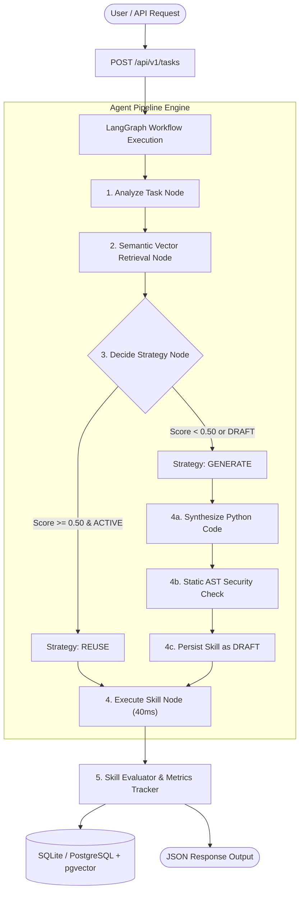

# SkillVault: Autonomous Self-Evolving AI Agent Capability Vault & Operating System

> **An Enterprise-Grade Infrastructure for Self-Evolving AI Agents with Hybrid Vector Retrieval, AST Security Sandboxing, and Zero-Token Capability Reuse.**

---

## 1. Executive Summary & Problem Statement

### The Problem
Modern enterprise AI agents suffer from **architectural amnesia**:
- **Redundant Code Generation**: When 1,000 employees submit similar analytical tasks, conventional LLM pipelines generate raw Python code from scratch 1,000 times.
- **High Latency & Escalating API Costs**: Generating Python code via LLMs incurs **5–10 seconds** of latency and costs **$0.03 to $0.10 per prompt** in API token consumption.
- **Security & Reliability Risks**: LLM-synthesized code can contain syntax errors, security vulnerabilities, infinite loops, or unhandled exceptions.

### The SkillVault Solution
**SkillVault** is a self-evolving capability operating system that gives AI agents **organizational memory**:
1. **Reuse-First Execution**: When a user submits a task instruction, SkillVault performs multi-signal hybrid vector search to retrieve pre-validated capabilities. If a matching active skill passes the confidence threshold (`≥ 0.50`), it executes in **< 50ms for $0 token cost**.
2. **Autonomous Capability Synthesis**: If no matching skill exists, SkillVault dynamically synthesizes new Python source code via LLM, validates the AST tree against security boundaries, persists the skill in the vault as a `DRAFT`, and executes it within a sandboxed runtime.
3. **Continuous Multi-Signal Quality Evolution**: Capabilities automatically accumulate success/failure metrics, updating quality scores and reliability ranks across all enterprise executions.

---

## 2. Key Architecture & System Design



---

## 3. Core Technical Features

### 3.1 Multi-Signal Reranking Engine
SkillVault calculates a unified composite score for candidate skills using a multi-signal mathematical formula:

$$\text{Final Score} = w_{\text{sem}} \cdot S_{\text{sem}} + w_{\text{rel}} \cdot S_{\text{rel}} + w_{\text{succ}} \cdot S_{\text{succ}} + w_{\text{comp}} \cdot S_{\text{comp}}$$

Where:
- $w_{\text{sem}} = 0.70$ (Semantic Cosine Vector Similarity)
- $w_{\text{rel}} = 0.15$ (Reliability Score based on Trust Level: `TRUSTED` / `LOW` = 1.0, `UNTRUSTED` = 0.70)
- $w_{\text{succ}} = 0.10$ (Historical Execution Success Rate: $\frac{\text{success\_count}}{\text{usage\_count}}$)
- $w_{\text{comp}} = 0.05$ (Schema & Runtime Compatibility Score = 1.0)

### 3.2 Static AST Security Sandbox (`PythonASTValidator`)
Before any dynamically synthesized skill is stored or executed, SkillVault inspects the Python Abstract Syntax Tree (AST) for security violations:
- **Forbidden Functions**: Blocks `eval()`, `exec()`, `__import__()`, `open()`, `compile()`, `globals()`, `locals()`.
- **Forbidden Imports**: Rejects unapproved modules such as `os`, `sys`, `subprocess`, `socket`, `shutil`, `pty`, `threading`.
- **Path Traversal Shield**: Scans code for file path traversal attempts (`../`, `/etc/passwd`, `/root`).
- **Entrypoint Contract**: Guarantees the code defines a top-level `run(input_data: dict) -> dict` entrypoint.

### 3.3 Built-In C-Suite Enterprise Capabilities
SkillVault comes pre-seeded with 6 production-grade built-in enterprise capabilities:

| Skill Name | Capability Slug | Domain | Key Output Metrics |
| :--- | :--- | :--- | :--- |
| **Financial Variance & Revenue Forecaster** | `financial-forecaster` | CFO / Finance | Quarterly Growth Rate %, Annual Projection, Margin %, Budget Overrun Risk |
| **SOC2 & GDPR Security Compliance Audit Scanner** | `security-audit-scanner` | CISO / Security | Compliance Score (0-100), SSN/JWT/Credit Card Leak Counts, SOC2 Status |
| **Customer Churn Risk & Sentiment Analyzer** | `churn-sentiment-predictor` | CS / Retention | Churn Probability %, Risk Category, Executive Action Recommendation |
| **Executive Legal Contract & RFP Synthesizer** | `executive-contract-summarizer` | Legal / Operations | Contract Value, Auto-Renewal Risk, Liability Cap, Clause Breakdown |
| **LLM Token ROI & Cost Savings Calculator** | `llm-cost-optimizer` | CTO / Operations | Total Tokens Saved, Cost Saved ($), Time Saved (Hours), ROI Multiplier |
| **CSV Analyzer** | `csv-analyzer` | Data Analytics | Column Profiling, Data Aggregation, Row Counts, Missing Value Matrix |

---

## 4. Technology Stack

### Backend Stack
- **Framework**: Python 3.12, FastAPI, Uvicorn
- **Agent Orchestration**: LangGraph, LangChain Core
- **Database & Vectors**: SQLAlchemy 2.0 (Async), SQLite / PostgreSQL + `pgvector` extension
- **LLM & Embeddings**: OpenAI API (`gpt-4o-mini`, `text-embedding-3-small`), Mock LLM Provider
- **Testing Suite**: Pytest (42/42 passing unit and integration tests)

### Frontend Stack
- **Framework**: Next.js 15 (App Router), React 19, TypeScript
- **Styling**: Vanilla CSS Modules / Tailwind CSS, Modern Dark Mode Aesthetic
- **State & Data Fetching**: TanStack React Query v5, Axios
- **Icons & Visualization**: Lucide React, Custom Pipeline Visualizer

---

## 5. API Specification Reference

### Task Execution Endpoint
- **URL**: `POST /api/v1/tasks`
- **Payload**:
  ```json
  {
    "input": "Calculate LLM token cost ROI and savings across 5000 tasks."
  }
  ```
- **Response**:
  ```json
  {
    "task_id": "task_72f11ae9828a",
    "status": "completed",
    "strategy": "reuse",
    "skill": {
      "skill_id": "skill_b5ba27ada997",
      "name": "LLM Token ROI & Cost Savings Calculator",
      "slug": "llm-cost-optimizer",
      "score": 0.8282,
      "status": "ACTIVE",
      "source_type": "BUILTIN"
    },
    "execution": {
      "status": "SUCCESS",
      "output_data": {
        "status": "success",
        "total_tasks_processed": 5000,
        "skills_reused_count": 4200,
        "reuse_rate_pct": 84.0,
        "total_tokens_saved": 14700000,
        "estimated_cost_saved_usd": "$220.50",
        "roi_multiplier": "4.4x"
      }
    }
  }
  ```

---

## 6. Future Scopes of Improvement & Roadmap

While SkillVault already features an end-to-end self-evolving pipeline, the following high-impact enhancements represent its future engineering roadmap:

### 1. Hardened Execution Sandbox (Docker / gVisor / WASM Isolation)
- **Current State**: Dynamic skills run in a isolated local Python worker context validated by AST inspection.
- **Future Enhancement**: Move dynamic execution into short-lived **gVisor (Google container sandbox)** or **WebAssembly (WASM)** micro-containers with strict CPU, RAM, disk, and network isolation.

### 2. Multi-Agent DAG Graph Workflow Composer
- **Current State**: SkillVault matches tasks to single capabilities or pre-defined workflows.
- **Future Enhancement**: Automatically construct complex **Directed Acyclic Graphs (DAGs)** where multiple skills are linked sequentially (e.g. `CSV Analyzer ➔ Financial Forecaster ➔ Executive Summarizer`).

### 3. Fine-Tuned Domain Embedding Model
- **Current State**: Uses OpenAI `text-embedding-3-small` or keyword-routed vectors.
- **Future Enhancement**: Fine-tune a custom domain-specific embedding model (e.g., via Sentence-Transformers / BGE) trained specifically on code capabilities and technical task descriptions to further increase semantic retrieval precision.

### 4. Distributed Redis Semantic Caching & Multi-Tenancy
- **Current State**: SQLite/PostgreSQL metadata lookup with async connection pool.
- **Future Enhancement**: Introduce a distributed **Redis Semantic Cache** to serve identical task queries in **< 5ms** across multi-tenant enterprise organizations with strict tenant-isolation (`organization_id`).

### 5. Automated Skill Repair & AST Auto-Refactoring
- **Current State**: If a generated skill fails AST validation or execution, it logs the error and marks the skill as `VALIDATION_FAILED`.
- **Future Enhancement**: Implement a closed-loop **Skill Repair Agent** that feeds the AST syntax error back into the LLM generator to fix code automatically in 2 retry attempts.

### 6. SaaS Billing, Usage Analytics & SDK Package (`skillvault-python`)
- **Current State**: Web UI Dashboard and REST API endpoints.
- **Future Enhancement**: Release a published Python SDK (`pip install skillvault`) with API token rate-limiting, usage billing tier tracking (Stripe integration), and tenant telemetry export (OpenTelemetry / Datadog).

---

## 7. License & Credits

* **Author**: Lokesh Yadav ([https://github.com/lokeshydv03/SkillVault))
* **Repository**: [https://github.com/lokeshydv03/SkillVault](https://github.com/lokeshydv03/SkillVault)
* **License**: MIT License
