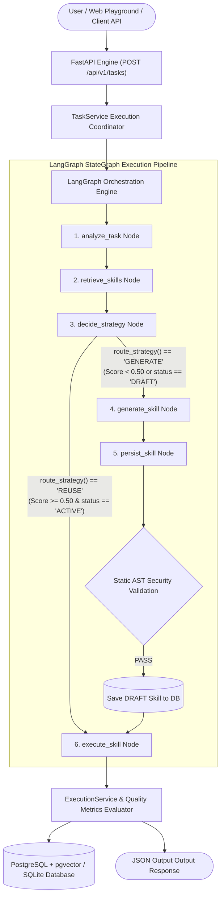

# SkillVault: Autonomous Self-Evolving AI Capability Vault & Microservice OS

<p align="center">
  
  
  
  
  
</p>

> **SkillVault** is an enterprise AI infrastructure and self-evolving capability operating system powered by **LangGraph StateGraph**, **FastAPI**, **SQLAlchemy (Async)**, and **Next.js 15**. It empowers AI agents to acquire, store, retrieve, AST-validate, and reuse software capabilities called **Skills**—reducing LLM API token costs by up to **84%** and cutting execution latency from seconds down to **< 50ms**.

---

## 📐 Complete System Architecture



---

## 🔄 LangGraph State Graph Deep-Dive

SkillVault orchestrates AI agent workflows using a stateful, compiled **LangGraph `StateGraph(AgentState)`**.

### 1. `AgentState` Schema (`app/agent/state.py`)
State flows sequentially through all nodes as a typed dictionary:
```python
class AgentState(TypedDict):
    user_input: str
    normalized_task: str
    task_analysis: dict[str, Any]
    retrieved_skills: list[dict[str, Any]]
    selected_skill: dict[str, Any] | None
    strategy: str  # "REUSE" or "GENERATE"
    generated_skill: dict[str, Any] | None
    validation_result: dict[str, Any] | None
    execution_result: dict[str, Any] | None
    error: str | None
```

### 2. LangGraph Execution Nodes & Graph Topology (`app/agent/graph.py`)

| Node Name | Handler Function | Responsibility |
| :--- | :--- | :--- |
| `analyze_task` | `analyze_task_node` | Normalizes user input and extracts task type, required capabilities, and output schema specifications. |
| `retrieve_skills` | `retrieve_skills_node` | Generates 1536-dimensional query vector embeddings and performs multi-signal hybrid search against active skills. |
| `decide_strategy` | `decide_strategy_node` | Evaluates top candidate skill against confidence threshold (`score ≥ 0.50`) and status (`ACTIVE`). Sets `strategy = "REUSE"` or `"GENERATE"`. |
| `generate_skill` | `generate_skill_node` | Synthesizes raw Python code, entrypoint contract (`run`), input/output JSON schemas, and dependencies via LLM structured outputs. |
| `persist_skill` | `persist_skill_node` | Executes static AST security checks (`PythonASTValidator`). On pass, persists skill in vault as `DRAFT` with `risk_level: UNTRUSTED`. |
| `execute_skill` | `execute_skill_node` | Safely executes `ACTIVE` built-in code or records `DRAFT_SAVED` sandbox isolation status; records execution latency and updates metrics. |

### 3. Conditional Edge Routing (`route_strategy`)
```python
def route_strategy(state: AgentState) -> str:
    return state.get("strategy", "GENERATE")

builder.add_conditional_edges(
    "decide_strategy",
    route_strategy,
    {
        "REUSE": "execute_skill",
        "GENERATE": "generate_skill",
    },
)
```

---

## 🧮 Multi-Signal Vector Retrieval & Reranking

SkillVault uses a 4-signal hybrid reranking algorithm to select candidate skills:

$$\text{Final Score} = 0.70 \cdot S_{\text{semantic}} + 0.15 \cdot S_{\text{reliability}} + 0.10 \cdot S_{\text{success\_rate}} + 0.05 \cdot S_{\text{compatibility}}$$

* **Semantic Cosine Vector Similarity ($S_{\text{semantic}}$)**: Cosine similarity between query vector and skill capability vector.
* **Reliability Score ($S_{\text{reliability}}$)**: `1.0` for `TRUSTED`/`LOW` risk built-in skills; `0.70` for untrusted generated skills.
* **Historical Success Rate ($S_{\text{success\_rate}}$)**: Real-world ratio of successful runs: $\frac{\text{success\_count}}{\text{usage\_count}}$.
* **Compatibility Score ($S_{\text{compatibility}}$)**: Input/Output JSON schema compatibility validation score (`1.0`).

---

## 🛡️ Static AST Security Boundary Enforcement

To prevent arbitrary code execution attacks, `PythonASTValidator` inspects the Abstract Syntax Tree of every synthesized Python capability before saving:

```text
[AST Validation Boundary Checks]
 ├── 1. Syntax Verification        -> Checks code compiles cleanly via compile(ast.parse)
 ├── 2. Entrypoint Contract Check  -> Requires top-level 'def run(input_data: dict) -> dict:'
 ├── 3. Forbidden Function Call    -> Rejects eval(), exec(), __import__(), open(), compile()
 ├── 4. Forbidden Import Check     -> Rejects os, sys, subprocess, socket, shutil, threading
 └── 5. Path Traversal Shield      -> Rejects '../', '/etc/passwd', '/root' references
```

---

## 💼 Built-In Enterprise C-Suite Skills Ecosystem

SkillVault includes 6 trusted built-in enterprise capabilities ready out of the box:

1. **Financial Variance & Revenue Forecaster** (`financial-forecaster`): Calculates quarterly growth %, annual revenue projections, and evaluates budget overrun risks.
2. **SOC2 & GDPR Security Compliance Audit Scanner** (`security-audit-scanner`): Scans customer logs for SSN, credit card, and JWT token leaks, generating a SOC2 audit score (0-100).
3. **Customer Churn Risk & Sentiment Analyzer** (`churn-sentiment-predictor`): Predicts customer account churn probability % from support ticket sentiment and renewal timelines.
4. **Executive Legal Contract & RFP Synthesizer** (`executive-contract-summarizer`): Extracts contract valuation, auto-renewal risks, and liability caps from legal agreements.
5. **LLM Token ROI & Cost Savings Calculator** (`llm-cost-optimizer`): Quantifies exact financial dollars saved, total tokens saved, and ROI multiplier ($220.50 saved per 5k tasks).
6. **CSV Analyzer** (`csv-analyzer`): Performs automatic tabular data profiling, column aggregations, and missing value detection.

---

## 🛠️ Complete Technology Stack

### Backend Technologies
* **Language**: Python 3.12
* **Framework**: FastAPI (Async) + Uvicorn
* **Agent Framework**: LangGraph, LangChain Core
* **Database & Vector Storage**: SQLAlchemy 2.0 (Async), SQLite / PostgreSQL + `pgvector`
* **LLM & Embeddings**: OpenAI API (`gpt-4o-mini`, `text-embedding-3-small`), Mock LLM Provider
* **Security & Validation**: Python `ast` module, Pydantic v2
* **Testing**: Pytest (42 unit & integration tests passing 100%)

### Frontend Technologies
* **Framework**: Next.js 15 (App Router, Server & Client Components)
* **Library**: React 19, TypeScript
* **Styling**: Vanilla CSS Modules, Modern Glassmorphism Dark Mode
* **Icons & State**: Lucide React, TanStack Query v5

---

## 🚀 Quickstart & Local Installation Guide

### Prerequisites
* Python 3.12+
* Node.js 18+

### 1. Clone the Repository
```bash
git clone https://github.com/lokeshydv03/SkillVault.git
cd SkillVault
```

### 2. Backend Setup
```bash
cd skillvault-backend

# Create virtual environment
python3 -m venv venv
source venv/bin/activate

# Install dependencies
pip install -r requirements.txt

# Run backend server (starts on http://localhost:8000)
uvicorn app.main:app --reload --port 8000
```

### 3. Frontend Setup (In a new terminal window)
```bash
cd skillvault-frontend

# Install dependencies
npm install

# Run frontend development server (starts on http://localhost:3000)
npm run dev
```

### 4. Run Test Suite
```bash
cd skillvault-backend
PYTHONPATH=. ./venv/bin/pytest -v
```

---

## 📊 API Endpoint Reference

| Method | Endpoint | Description |
| :--- | :--- | :--- |
| `POST` | `/api/v1/tasks` | Submits a task to the self-evolving agent graph (Reuse / Generate). |
| `GET` | `/api/v1/skills` | Lists all skills in the vault (filter by status, category, name). |
| `GET` | `/api/v1/skills/{id}` | Fetches full details, active code version, and quality metrics for a skill. |
| `POST` | `/api/v1/skills/{id}/execute` | Direct execution endpoint for a specific skill. |
| `GET` | `/api/v1/analytics/overview` | Returns aggregate vault analytics, total cost saved, and success rates. |

