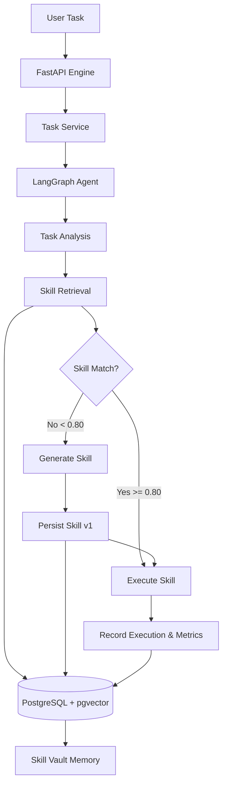

# SkillVault Backend — Production Specification & Built-in Skill Ecosystem

**SkillVault** is a FastAPI backend and agent orchestration platform for a self-evolving AI agent that can acquire, store, retrieve, execute, and reuse software capabilities called **Skills**.

> An AI agent should not generate a solution from scratch every time it encounters a task. When it discovers that it lacks a capability, it should synthesize a reusable Skill, store that Skill in a persistent Skill Vault, and retrieve it for future tasks and operations.

---

## Architecture Diagram



---

## Built-in Skills Ecosystem

The system establishes an initial baseline of 6 trusted built-in skills:

1. **CSV Analyzer (`csv-analyzer`)**: Parses CSV files/data, performs profiling, column analysis, missing value detection, and numerical statistics.
2. **Sales Analyzer (`sales-analyzer`)**: Parses sales transaction CSVs, calculates total revenue (`quantity * unit_price`), revenue by product, region, salesperson, category, and AOV.
3. **JSON Transformer (`json-transformer`)**: Filters, sorts, groups, and transforms structured JSON datasets.
4. **Text Analyzer (`text-analyzer`)**: Computes character counts, word counts, sentence counts, paragraph counts, and top keyword frequencies.
5. **Markdown Analyzer (`markdown-analyzer`)**: Parses Markdown documents, extracting document title, H1/H2/H3 headings, bullet lists, numbered lists, and word counts.
6. **Statistics (`statistics`)**: Computes mean, median, min, max, standard deviation, variance, and 25th/50th/75th percentiles on numerical arrays.

---

## Sample Datasets (`sample_data/`)

- `sample_data/employees.csv`: 25 realistic employee records with Indian cities (Bangalore, Mumbai, Delhi, Hyderabad, Pune, Chennai, Kolkata, Gurgaon, Noida), departments, salaries, ratings, and experience.
- `sample_data/sales.csv`: 25 realistic sales transactions with order IDs, dates, customers, products, categories, quantities, unit prices, regions, and salespeople.
- `sample_data/products.json`: 10 detailed products with pricing, stock, ratings, and tags across Electronics, Accessories, Networking, and Office categories.
- `sample_data/article.md`: 600-word technical Markdown article on "Agentic AI and Persistent Skill Libraries".

---

## Security Boundary Architecture

```text
Built-in Skills ──► TRUSTED ──► Can execute locally via LocalSkillExecutor

LLM Generated Skills ──► UNTRUSTED ──► Persist metadata & code ──► Requires Docker Sandbox
```

Generated skills are initially marked as `UNTRUSTED` / `DRAFT` and not executed directly in unrestricted environments until Docker sandboxing is enabled.

---

## Local Setup & Commands

### 1. Virtual Environment & Dependencies

```bash
python3 -m venv venv
source venv/bin/activate
pip install -r requirements.txt
cp .env.example .env
```

### 2. Database with PostgreSQL & pgvector

```bash
docker-compose up -d
```

### 3. Database Migrations

```bash
alembic upgrade head
```

### 4. Idempotent Skill Vault Seeding

```bash
python -m app.db.seed
```

### 5. Run API Server

```bash
uvicorn app.main:app --reload --port 8000
```

- Swagger UI: `http://localhost:8000/docs`
- ReDoc: `http://localhost:8000/redoc`

### 6. Run Test Suite

```bash
PYTHONPATH=. ./venv/bin/pytest -v
```

### 7. Run End-to-End SkillVault Demo

```bash
PYTHONPATH=. ./venv/bin/python scripts/demo_skillvault.py
```

---

## API Summary

- `POST /api/v1/tasks`: Submit a task to the agent lifecycle (`REUSE` or `GENERATE`).
- `GET /api/v1/tasks/{task_id}`: Retrieve task status and execution results.
- `GET /api/v1/skills`: List skills with status, category, and name filters.
- `POST /api/v1/skills/search`: Perform semantic pgvector similarity search.
- `GET /api/v1/executions/{execution_id}`: Get detailed execution metrics.
